# Ideal CST Project Documentation

Generated from the source code in this repository. Code references use project-relative paths.

## 1. Project Introduction

| Item | Details |
| --- | --- |
| Project name | `ideal_cst` Flutter application, shown in-app as `Construct Pro` / `CST Dashboard` |
| Domain | Construction labour, attendance, site, project, expense, material, tool, and vehicle management |
| Primary users | Organization user, Manager/Config user, Supervisor, Contractor/Sub-Contractor |
| Primary datastore | Firebase Cloud Firestore project `cst-pratap-demo` |
| Primary platforms | Flutter Android, iOS, macOS, Windows, Web; Linux is not configured in `firebase_options.dart` |

### Purpose

The system manages construction sites and projects, assigns supervisors to sites, configures labour categories and wages, creates subcontractors and workers, records daily labour attendance, captures meals and bus fare entries, and produces organization-level reports.

### Business Objectives

- Provide a role-based entry point for organization, manager/config, supervisor, and contractor users.
- Maintain site, project, supervisor, contractor, subcontractor, worker, labour, material, tool, and vehicle records.
- Capture daily labour attendance with worker/subcontractor grouping, attendance type, in/out time, overtime, salary calculations, meals, and bus fare.
- Aggregate site expenses and sync them to project financial summaries.
- Export labour reports as PDF, Excel, and CSV where implemented.

### Key Features

- Flutter Material 3 multi-platform client.
- Firebase initialization through FlutterFire generated options.
- Firestore-backed login flows with local session persistence using `shared_preferences`.
- Manager/configuration modules for sites, projects, supervisors, labour categories, materials, contractors, tools, and vehicles.
- Supervisor modules for assigned sites, subcontractors, workers, attendance, material/tool movement, work schedules, and verification.
- Organization dashboard reports, including labour attendance and labour details reports.
- Report export via `pdf`, `printing`, `excel_community`, `share_plus`, `path_provider`, and web download utilities.

## 2. System Architecture

### High-Level Architecture

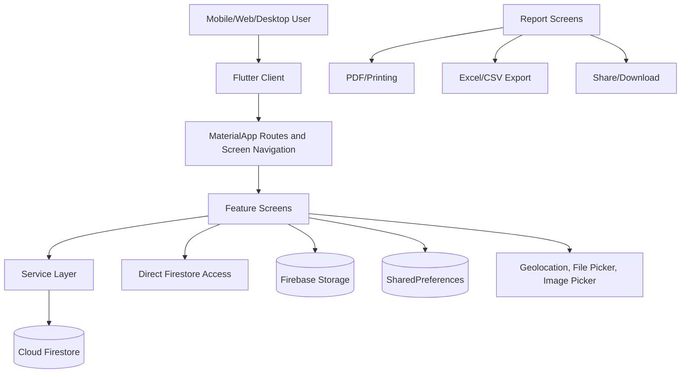

### Module Architecture

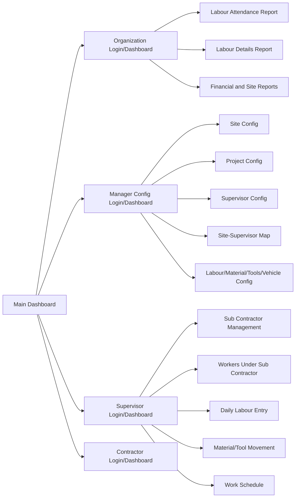

### Component Architecture

- `lib/main.dart`: initializes Firebase and configures routes.
- `lib/firebase_options.dart`: generated Firebase platform configuration.
- `lib/screens/*`: feature UI, role dashboards, forms, reports, and Firestore workflows.
- `lib/services/*`: reusable domain services for workforce, attendance, salary, and expense calculations.
- `lib/models/*`: typed Dart models for the newer workforce/attendance/salary collections.
- `lib/utils/*`: web and non-web download helpers.
- `assets/*`: app images and Lottie animations.
- `docs/*`: Flutter web build output plus this documentation file.

### Primary Data Flow

```mermaid
flowchart TD
    ManagerLogin[Manager/Config Login] --> Configure[Configure Site, Project, Supervisor, Labour]
    Configure --> Map[Assign Supervisor to Site]
    SupervisorLogin[Supervisor Login] --> AssignedSites[Load Assigned Sites]
    AssignedSites --> SubCon[Create Sub Contractors]
    SubCon --> Worker[Create Workers]
    AssignedSites --> Daily[Create Daily Labour Entry]
    Worker --> Daily
    Daily --> AttendanceDoc[attendance/{siteId_date}/workers]
    Daily --> FlatEntry[daily_labour_entries]
    Daily --> Reports[Organization Reports]
    Expenses[Expense Modules] --> Totals[totalSiteExpensesPerDay]
    Totals --> ProjectFinance[projects.amountSpent and amountBalance]
```

### Sequence: Daily Labour Entry

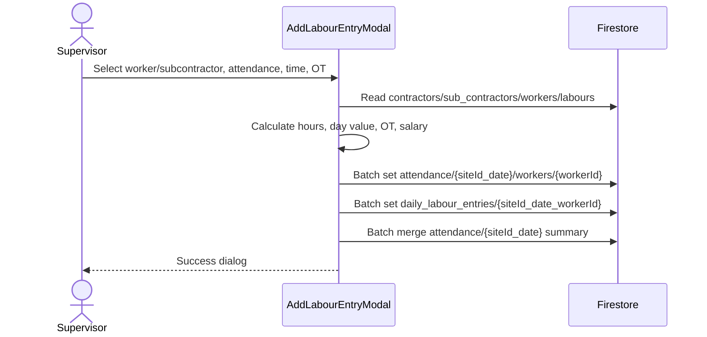

### Sequence: Report Generation

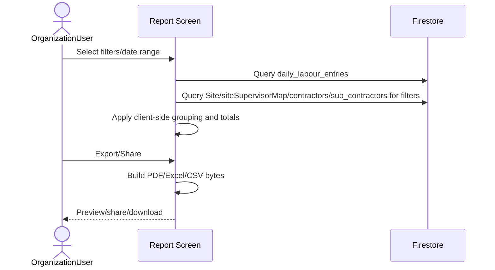

## 3. Technology Stack

| Category | Implementation |
| --- | --- |
| Frontend | Flutter, Dart SDK `^3.8.1`, Material 3 |
| Backend | No separate server in this repository; client reads/writes Firebase services directly |
| Database | Cloud Firestore |
| Authentication | Firestore credential lookups in `organizationUser`, `configUser`, `supervisor`, and `contractors`; Firebase Auth is included but not used as the main login mechanism in inspected login screens |
| Session persistence | `shared_preferences` |
| State management | StatefulWidget/local state; Streams and FutureBuilders; no global state management package |
| File/media | `image_picker`, `file_picker`, `firebase_storage`, `path_provider`, `open_file`, `share_plus` |
| Reports | `pdf`, `printing`, `excel_community`, CSV string generation |
| Location | `geolocator`, `geocoding` |
| WebView | `webview_flutter`, Android and WKWebView implementations |
| UI assets | Lottie animations, PNG/JPG images |
| Deployment | Firebase hosting-style web output under `docs/`; Android config in `android/app/google-services.json`; `firebase.json` maps FlutterFire apps |

## 4. Folder Structure

```text
Ideal_cst_app/
  android/                 Android Flutter host project and Google services config
  assets/
    animation/             Lottie animation assets
    images/                Splash and construction images
  docs/                    Flutter web build output and generated documentation
  ios/                     iOS Flutter host project
  lib/
    main.dart              App bootstrap, Firebase initialization, route table
    firebase_options.dart  FlutterFire generated platform options
    models/                Typed data models for workforce, attendance, salary, costs
    screens/               UI screens, modules, dashboards, reports, forms
    services/              Workforce, attendance, salary, expense services
    stub/                  Platform stubs
    utils/                 Download helpers for web/non-web
  linux/                   Linux Flutter host project; Firebase options not configured
  macos/                   macOS Flutter host project
  test/                    Flutter widget test scaffold
  web/                     Web host files and icons
  windows/                 Windows Flutter host project
  pubspec.yaml             Dependencies and assets
  firebase.json            FlutterFire/Firebase project metadata
```

Important files:

| File | Purpose |
| --- | --- |
| `lib/main.dart` | Calls `Firebase.initializeApp`, sets app title `Construct Pro`, and defines routes `/`, `/letsStart`, `/dashboard`, `/reports/site-labour-report` |
| `lib/screens/main_dashboard.dart` | Role selection dashboard |
| `lib/screens/Organisation_LoginPage.dart` | Organization login against `organizationUser` |
| `lib/screens/config_login.dart` | Manager/config login against `configUser` |
| `lib/screens/supervisor_login_page.dart` | Supervisor and contractor-style login against `supervisor` and `contractors` |
| `lib/screens/site_screen.dart` | Site create/list/update/delete flow |
| `lib/screens/project_screen.dart` | Project create/update financial and stage flow |
| `lib/screens/Site_Supervisor_Config.dart` | Supervisor creation, uniqueness checks, password update |
| `lib/screens/site_supervisor_map_screen.dart` | Site-supervisor assignment |
| `lib/screens/sub_contractor_management_screen.dart` | Newer subcontractor CRUD |
| `lib/screens/sub_contractor_workers_screen.dart` | Newer worker CRUD under subcontractor |
| `lib/screens/add_labour_entry_modal.dart` | Daily labour creation modal |
| `lib/screens/daily_labour_entry_screen.dart` | Daily attendance listing, meals, bus fare update/delete |
| `lib/screens/site_labour_attendance_report_screen.dart` | Attendance report with PDF/Excel export |
| `lib/screens/site_labour_details_report_screen.dart` | Labour details report with salary, meals, bus fare, PDF/Excel/CSV export |

## 5. User Roles and Permissions

The application implements role separation primarily through screen routing and Firestore lookups, not centralized server-side authorization in this repository.

| Role | Login source | Capabilities in code |
| --- | --- | --- |
| Organization | `organizationUser` with `Username`/`Password` | Access organization dashboard and reports such as labour attendance, labour details, financial/status/site reports |
| Manager / Config | `configUser` | Configure sites, projects, supervisors, labour, material, contractors, tools, vehicles, approvals, expenses |
| Supervisor | `supervisor` with `UserName`/`Password` | Access assigned sites, create subcontractors/workers, create attendance, material requests, tools, work schedule, verification |
| Contractor / Sub-Contractor | `contractors` login or supervisor login contractor mode | Contractor entry/report/dashboard workflows, worker/activity access tied to contractor data |

## 6. Module Documentation

### Authentication Module

Implementation files:

- `lib/screens/Organisation_LoginPage.dart`
- `lib/screens/config_login.dart`
- `lib/screens/supervisor_login_page.dart`
- `lib/screens/contractor_login_page.dart`

Login behavior:

- Organization login queries `organizationUser` where `Username` and `Password` match.
- Supervisor login queries `supervisor` where `UserName` and `Password` match.
- Supervisor login supports contractor mode: selected contractor name is looked up in `contractors`, then navigates to `ContractorEntryPage`.
- Sessions are stored with role-specific `SharedPreferences` keys.
- Password reset/update exists in supervisor login and supervisor config; passwords are stored in Firestore document fields.

Session management:

- Organization session keys include `org_isLoggedIn` and `org_username`.
- Supervisor session keys include `sup_isLoggedIn`, `sup_userType`, `sup_username`, `sup_supervisorId`, `sup_supervisorName`, `sup_isContractor`, `sup_contractorName`, `sup_contractorField`.

### Site Management Module

Implementation file: `lib/screens/site_screen.dart`

Create site:

- Reads dropdown master data from `projectCategories` and `projectStatus`.
- Generates IDs like `ST001` by scanning `Site.siteId`.
- Uses geolocation to populate latitude, longitude, and address if allowed.
- Validates required site name, location, and dates/status selections through form validators.
- Stores site data in `Site`.

Update/delete:

- Lists all sites from `Site`.
- Updates matching site documents.
- Deletes site and related project records where implemented in the screen.

### Project Management Module

Implementation file: `lib/screens/project_screen.dart`

Create/update project:

- Generates project IDs like `PR001`.
- Links project to a selected site.
- Reads sites from `Site`, assignments from `siteSupervisorMap`, and expenses from `totalSiteExpensesPerDay`.
- Maintains financial fields such as amount paid, amount spent, balance, project budget, contractor budget.
- Syncs `projectStage` changes into `siteSupervisorMap` for the same site.
- Updates project financial summary from site expense totals.

### Supervisor Management Module

Implementation files:

- `lib/screens/Site_Supervisor_Config.dart`
- `lib/screens/site_supervisor_map_screen.dart`

Create supervisor:

- Reads designations from `supervisorDesignation`.
- Validates required fields.
- Checks uniqueness of `UserName` and `ContactNo` in `supervisor`.
- Creates supervisor records with generated supervisor IDs.

Assign supervisor:

- Reads sites from `Site`, supervisors from `supervisor`, and stages from `projectStages`.
- Writes assignments to `siteSupervisorMap`.

### Sub Contractor Management Module

Implementation files:

- `lib/screens/sub_contractor_management_screen.dart`
- `lib/models/sub_contractor.dart`
- `lib/services/workforce_service.dart`

Create/edit/delete:

- Uses `WorkforceService.createSubContractor`, `updateSubContractor`, and `deleteSubContractor`.
- Stores records in `sub_contractors`.
- Generates contractor IDs like `IC001` by ordering `sub_contractors.contractorId`.
- Loads labour categories from `labours` and auto-fills salary rate from `labours.salary`.
- Assigns subcontractors to selected site IDs.
- Supports active/inactive status toggle.

Important fields:

- `name`, `contractorId`, `category`, `mobileNumber`, `address`, `labourType`, `salaryType`, `salaryRate`, `assignedSiteIds`, `isActive`, `joiningDate`, `notes`, `supervisorId`, `supervisorName`.

### Worker Management Module

Implementation files:

- `lib/screens/sub_contractor_workers_screen.dart`
- `lib/models/worker.dart`
- `lib/services/workforce_service.dart`

Create/edit/delete:

- Workers are created under a selected `SubContractor`.
- Stores records in `workers`.
- Generates worker IDs like `W001`.
- Loads categories from `labours`.
- Auto-fills basic salary and default working hours.
- Supports salary types `Daily Wage` and `Monthly Wage`.
- Requires at least one assigned site.
- Soft delete updates `isDeleted`, `deletedAt`, and `deletedBy`; hard delete is also available in service.

### Attendance Module

Implementation files:

- `lib/screens/add_labour_entry_modal.dart`
- `lib/screens/daily_labour_entry_screen.dart`
- `lib/services/attendance_service.dart`
- `lib/services/workforce_service.dart`
- `lib/models/worker_attendance.dart`

Attendance creation:

- Loads existing daily entries from `daily_labour_entries` to block duplicate worker entry for same site/date/supervisor.
- Loads labour categories from `labours`.
- Loads contractors from both `contractors` and `sub_contractors`.
- Loads workers from `workers`.
- Saves each entry to both:
  - nested `attendance/{siteId_date}/workers/{workerId}`
  - flat `daily_labour_entries/{siteId_date_workerId}`
- Updates parent `attendance/{siteId_date}` summary with counts for full day, half day, early out, absent, leave, total overtime, and effective labour count.

Attendance types:

- `Full Day`
- `Half Day`
- `Early Out`
- `Overtime`
- `Absent`
- `Leave`
- `Night Shift`

Day value logic:

- Full day and night shift count as `1.0`.
- Half day and early out count as partial attendance.
- Absent and leave count as `0.0`.

Time and salary logic:

- In/out time fields are parsed to calculate hours worked.
- Overtime can be provided directly.
- Salary fields include `basicSalary`, `defaultHours`, `hoursWorked`, `overtimeHours`, `overtimeAmount`, `totalSalary`.
- `WorkerAttendance` model provides helper methods for regular hours capped at 8 hours and overtime hours above 8 hours.

### Meals Module

Implementation files:

- `lib/screens/add_labour_entry_modal.dart`
- `lib/screens/daily_labour_entry_screen.dart`
- `lib/screens/site_labour_details_report_screen.dart`

Creation/update:

- New attendance entries initialize `mealsCount` and `mealsAmount` to `0`.
- The daily labour entry screen updates meals fields on both nested attendance worker documents and flat `daily_labour_entries`.

Calculation:

- Labour Details Report calculates total meals amount as `mealsCount * mealsAmount`.
- Group totals aggregate meals count and total meals amount.

### Bus Fare Module

Implementation files:

- `lib/screens/add_labour_entry_modal.dart`
- `lib/screens/daily_labour_entry_screen.dart`
- `lib/screens/site_labour_details_report_screen.dart`

Creation/update:

- New attendance entries initialize `busCount` and `busAmount` to `0`.
- The daily labour entry screen updates bus fields on both nested attendance worker documents and flat `daily_labour_entries`.

Calculation:

- Labour Details Report calculates total bus amount as `busCount * busAmount`.
- Group totals aggregate bus count and total bus amount.

### Reports Module

#### Labour Attendance Report

Implementation file: `lib/screens/site_labour_attendance_report_screen.dart`

Data sources:

- Primary: `daily_labour_entries`
- Additional merge source if present: `site_labour_reports`
- Filters: `Site`, `siteSupervisorMap`, `contractors`, `sub_contractors`

Features:

- Date/date range filtering.
- Site, supervisor, contractor, and labour type filtering.
- Client-side grouping by site, supervisor, category, labour type, contractor, and date.
- Totals for sites, supervisors, contractors, labour count, OT hours, and night-shift/ST hours.
- PDF preview/download.
- Excel export.
- Share/download behavior, including web download helper.

#### Labour Details Report

Implementation file: `lib/screens/site_labour_details_report_screen.dart`

Data source:

- `daily_labour_entries`
- Filter source: `Site`; helper methods also exist for supervisors, subcontractors, and categories.

Features:

- Groups by site, site name, subcontractor, group, and category.
- Computes labour count, salary basic, total salary, hours, OT salary/rate, OT amount, meals, and bus fare totals.
- Exports PDF, Excel, and CSV.
- Shares generated files with `share_plus`.

## 7. Database Documentation

The app uses Cloud Firestore directly from Flutter. There are no SQL tables. The following collections were identified by code scan.

### Core Labour/Workforce Collections

| Collection | Purpose | Important fields |
| --- | --- | --- |
| `sub_contractors` | Newer subcontractor records | `id`, `name`, `contractorId`, `category`, `mobileNumber`, `address`, `labourType`, `salaryType`, `salaryRate`, `assignedSiteIds`, `isActive`, `joiningDate`, `notes`, `supervisorId`, `supervisorName`, `createdAt`, `updatedAt` |
| `workers` | Newer worker records and attendance worker source | `name`, `workerId`, `workerType`, `salaryType`, `basicSalary`, `overtimeRate`, `defaultHours`, `mobileNumber`, `subContractorId`, `subContractorName`, `supervisorId`, `supervisorName`, `assignedSiteIds`, `isDeleted` |
| `worker_attendance` | Service-layer typed attendance records | `workerId`, `workerName`, `workerType`, `subContractorId`, `siteId`, `date`, `hoursWorked`, `regularHours`, `overtimeHours`, `overtimeAmount`, `workType`, `status` |
| `attendance_summary` | Per-worker daily summary | `workerId`, `date`, `totalHoursWorked`, `totalRegularHours`, `totalOvertimeHours`, `totalOvertimeAmount`, `siteBreakdown` |
| `worker_transfers` | Worker transfer history | `workerId`, `fromSiteId`, `toSiteId`, `transferDate`, `reason`, `approvedBy`, `supervisorId` |
| `daily_labour_cost` | Daily labour cost summary | `date`, `siteId`, `totalWorkers`, `totalRegularCost`, `totalOvertimeCost`, `totalCost`, `workerBreakdown` |
| `weekly_labour_cost` | Weekly labour cost summary | `weekNumber`, `year`, `startDate`, `endDate`, `siteId`, `totalWorkers`, `totalCost` |
| `monthly_labour_cost` | Monthly labour cost summary | `month`, `year`, `siteId`, `totalWorkers`, `totalCost` |
| `salary_records` | Generated salary records | `workerId`, `startDate`, `endDate`, `attendanceDays`, `regularHours`, `overtimeHours`, `basicSalary`, `overtimeSalary`, `advances`, `deductions`, `netSalary`, `status` |
| `worker_advances` | Worker advances/loans | `workerId`, `type`, `amount`, `description`, `date`, `status`, `createdBy` |
| `worker_deductions` | Worker deductions | `workerId`, `type`, `amount`, `description`, `date`, `createdBy` |
| `overtime_records` | Overtime records | `workerId`, `siteId`, `date`, `overtimeHours`, `overtimeRate`, `overtimeAmount` |
| `leave_records` | Leave records | `workerId`, `leaveType`, `startDate`, `endDate`, `totalDays`, `status`, `approvedBy` |

### Attendance Entry Collections

| Collection/path | Purpose | Important fields |
| --- | --- | --- |
| `attendance/{siteId_date}` | Parent attendance summary by site/date | `siteId`, `siteName`, `supervisorId`, `supervisorName`, `date`, `totalWorkers`, `summary`, `updatedAt` |
| `attendance/{siteId_date}/workers/{workerId}` | Nested worker/subcontractor attendance entry | Worker identity, contractor identity, attendance type, time, OT, meals, bus, salary fields |
| `daily_labour_entries/{siteId_date_workerId}` | Flat reporting copy of attendance worker entry | Same entry shape as nested worker attendance, used by reports |
| `site_labour_reports` | Alternate/legacy report source | `date`, `siteCode`, `supervisor`, `categoryType`, `labourType`, `subContractor`, `workerCount`, `otDetails`, `remarks` |

### Configuration and Master Data Collections

| Collection | Purpose |
| --- | --- |
| `Site` | Site master records |
| `projects` | Project master and financial records |
| `projectCategories` | Project category dropdown values |
| `projectStatus` | Project status dropdown values |
| `projectStages` | Project stage dropdown values |
| `projectFinances` | Site/project status finance records |
| `projectContracts` / related project contract screens | Contract master/workflow where used |
| `supervisor` | Supervisor users |
| `supervisorDesignation` | Supervisor designation dropdown values |
| `siteSupervisorMap` | Site-to-supervisor assignment with site, supervisor, stage, and project references |
| `labours` | Labour category/designation salary master |
| `contractors` | Legacy contractor/subcontractor records and contractor login source |
| `workersConfig` | Legacy configured worker records |
| `workerSiteMap` | Legacy worker-to-site assignment |
| `organizationUser` | Organization login credentials |
| `configUser` | Manager/config login credentials |

### Expense and Financial Collections

| Collection | Purpose |
| --- | --- |
| `siteSupervisorEntries` | Supervisor/site expense or entry records |
| `managerEntries` | Manager expense/entry records |
| `organizationEntries` | Organization expense records |
| `contractorEntries` | Contractor expense/material/labour entries |
| `managerExpenseSummary` | Manager expense summaries |
| `organizationExpenseSummary` | Organization expense summaries |
| `siteSupervisorIncentives` | Incentive expenses |
| `totalSiteExpensesPerDay` | Aggregated expense totals per site; synced to `projects` |
| `siteSupervisorPayments` | Site supervisor payment records |

### Materials, Tools, Vehicles, Documents

| Collection | Purpose |
| --- | --- |
| `materials`, `materialCategories`, `materialSubCategories`, `materialUnits` | Material master data |
| `materialsavailablity`, `materialatsite`, `materialsAtSite`, `materialsInventory`, `materialmovementhistory` | Material stock and movement |
| `siteMaterialsRequest`, `material_requests` | Material requests and approval flows |
| `tools`, `toolsAtCompany`, `toolsAtSite`, `toolsInventory`, `toolsMovement`, `toolsReturn` | Tool master, stock, movement, return |
| `drivers`, `vehicleDetails`, `vehicleMovements` | Vehicle and driver configuration/movement |
| `siteDrawings` | Drawings/layout documents |
| `site_progress`, `supervisorPhotoLogs` | Site progress and supervisor verification photo logs |
| `workersAttendance`, `workersSummary`, `WorkerAllDetails`, `WorkerSummary` | Legacy worker attendance/summary report collections |

### Relationships

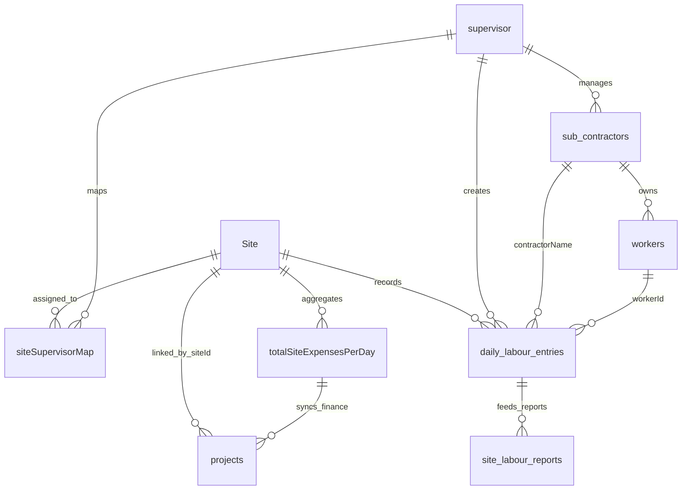

### Indexes

No Firestore composite index JSON was found in the repository. Queries using multiple `where` clauses with range/order requirements may require Firestore console-created composite indexes at runtime. Examples include date range queries on `daily_labour_entries`, attendance date/site queries, and worker attendance by worker/date.

### Sample Records

`sub_contractors`:

```json
{
  "id": "firestoreDocId",
  "name": "ABC Labour",
  "contractorId": "IC001",
  "category": "Mason",
  "mobileNumber": "9999999999",
  "labourType": "Sub Contractor",
  "salaryType": "Sub Contractor",
  "salaryRate": 850,
  "assignedSiteIds": ["ST001"],
  "isActive": true,
  "joiningDate": "2026-06-30T00:00:00.000",
  "supervisorId": "SUP001",
  "supervisorName": "Supervisor Name"
}
```

`daily_labour_entries`:

```json
{
  "workerId": "W001",
  "workerName": "Worker Name",
  "category": "Mason",
  "contractorName": "ABC Labour",
  "labourType": "Daily Wage",
  "attendanceType": "Full Day",
  "inTime": "09:00 AM",
  "outTime": "06:00 PM",
  "otHours": "1 Hours",
  "dayValue": 1,
  "siteId": "ST001",
  "siteName": "Site Name",
  "date": "2026-06-30",
  "mealsCount": 1,
  "mealsAmount": 50,
  "busCount": 1,
  "busAmount": 40,
  "basicSalary": 850,
  "hoursWorked": 9,
  "overtimeHours": 1,
  "overtimeAmount": 106.25,
  "totalSalary": 956.25
}
```

## 8. API Documentation

There are no REST/HTTP API endpoints implemented in this repository. The client uses Firestore SDK operations directly. The practical API surface is the service layer and screen-level Firestore access.

### Service APIs

| API | Method | Data store | Purpose |
| --- | --- | --- | --- |
| `WorkforceService.createSubContractor(contractor)` | Firestore `set` | `sub_contractors` | Create subcontractor with generated doc ID and `createdAt` |
| `WorkforceService.updateSubContractor(contractor)` | Firestore `update` | `sub_contractors/{id}` | Update subcontractor and `updatedAt` |
| `WorkforceService.deleteSubContractor(id)` | Firestore `delete` | `sub_contractors/{id}` | Delete subcontractor |
| `WorkforceService.getSubContractorsBySupervisor(supervisorId)` | Stream query | `sub_contractors` | Stream subcontractors for supervisor |
| `WorkforceService.createWorker(worker)` | Firestore `set` | `workers` | Create worker |
| `WorkforceService.updateWorker(worker)` | Firestore `update` | `workers/{id}` | Update worker |
| `WorkforceService.softDeleteWorker(id, deletedBy)` | Firestore `update` | `workers/{id}` | Mark worker deleted |
| `WorkforceService.getWorkersBySubContractor(id)` | Stream query | `workers` | Stream active workers by subcontractor |
| `AttendanceService.createWorkerAttendance(attendance)` | Firestore `add` | `worker_attendance` | Create typed attendance record |
| `AttendanceService.calculateAndSaveDailySummary(workerId, date)` | Query and upsert | `worker_attendance`, `attendance_summary` | Recalculate worker daily summary |
| `SalaryService.generateSalaryForPeriod(...)` | Query and write | `worker_attendance`, `worker_advances`, `worker_deductions`, `salary_records` | Generate salary records |
| `ExpenseService.recalcTotalsAndSyncProject(siteId)` | Transaction | Expense summary collections, `totalSiteExpensesPerDay`, `projects` | Recalculate site expenses and sync project balances |

### Request/Response Semantics

- Request bodies are Dart model instances or form state maps.
- Responses are Firestore document IDs, streams/lists of model instances, or void.
- Validation is performed in forms before service calls.
- Error handling is mostly `try/catch`, debug logging, snackbars, or silent fallback in some report/filter methods.
- Authentication requirement is implicit: screens are reachable after role login. Firestore security rules are not present in this repo.

## 9. Business Rules

### Attendance Rules

- Daily attendance entries are identified by `siteId`, `date`, and `workerId`.
- The flat report document ID is `${siteId}_${date}_${workerId}`.
- Duplicate worker entries for a site/date/supervisor are blocked by loading existing `daily_labour_entries`.
- Parent attendance summary counts full day, half day, early out, absent, leave, total OT hours, and effective labour count.
- Night shift is counted as a full day and contributes to ST/night-shift hours in the attendance report.
- Regular hours are capped at 8 in `WorkerAttendance.calculateRegularHours`.
- Overtime hours are hours above 8 in `WorkerAttendance.calculateOvertimeHours`.

### Labour Configuration Rules

- Labour designations and salary values come from `labours`.
- Subcontractor category selection auto-fills salary rate from the selected labour designation.
- Worker category selection auto-fills basic salary and default working hours.
- Worker salary type is either `Daily Wage` or `Monthly Wage` in the newer worker form.

### Salary Rules

- Daily wage salary generation calculates `attendanceDays * worker.basicSalary + overtime`.
- Monthly wage salary generation uses worker basic salary plus overtime.
- Advances and deductions within the salary period are subtracted from net salary.
- Salary status enum values are `generated`, `approved`, `paid`, and `cancelled`.

### Meals Rules

- Meals fields default to zero on new daily labour entry.
- Total meals amount is `mealsCount * mealsAmount`.
- Report group totals aggregate meal counts and amount totals.

### Bus Fare Rules

- Bus fare fields default to zero on new daily labour entry.
- Total bus fare amount is `busCount * busAmount`.
- Report group totals aggregate bus counts and amount totals.

### Reporting Rules

- Labour Attendance Report uses `daily_labour_entries` as its primary source.
- It merges `site_labour_reports` if present, normalizing field names.
- Labour type is displayed as `SC` if raw value contains `sub` or is `SC`; otherwise `DW`.
- Labour Details Report groups by site, subcontractor, group, and category.

### User Access Rules

- Organization, manager/config, supervisor, and contractor roles use different login screens and different SharedPreferences keys.
- Supervisor data is scoped by `supervisorId` or `supervisorName` in most supervisor screens.
- Contractor mode stores contractor name and field in supervisor login SharedPreferences.

## 10. Validation Rules

### Frontend Validation

Examples found in code:

- Required text fields for site name, location, supervisor details, contractor/worker names, mobile numbers, categories.
- Supervisor username and contact number uniqueness checks before create.
- Worker form requires at least one assigned site.
- Add labour entry requires worker name and mobile when creating a new worker.
- Add labour entry requires selected existing worker when not creating new.
- Date pickers constrain years between approximately 2000 and 2100/2101.
- Site end date is cleared if it becomes earlier than start date.
- Manager approval validates approved days cannot exceed estimated days.

### Backend/Database Validation

- No server-side validators or Firestore security rules are included in this repository.
- Firestore document fields are dynamically typed, with model factories providing defaults when fields are missing.

## 11. Security Implementation

Current implementation:

- Firebase project configuration is client-side via FlutterFire.
- Role logins validate credentials by querying Firestore fields.
- Session state is persisted in `SharedPreferences`.
- Some screens scope queries by supervisor ID/name after login.
- Firebase Storage is included for document/image workflows.

Security gaps visible from code:

- Passwords appear to be stored as plain Firestore fields in `organizationUser`, `configUser`, `supervisor`, and `contractors`.
- Firebase Auth dependency exists but inspected login flows do not use Firebase Auth sign-in.
- No Firestore security rules are present in the repository.
- Authorization is mostly client-side navigation and query filtering.

Recommended security enhancements:

- Migrate credential handling to Firebase Authentication or a secure backend.
- Store role claims or role documents and enforce them through Firestore security rules.
- Avoid storing plaintext passwords.
- Add input validation at the Firestore rules/backend layer.
- Review file upload permissions for Firebase Storage.

## 12. Sub Contractor Management Flow

Detailed documentation for the complete Sub Contractor Management workflow is available in a separate text file:

- **File Path**: `docs/Sub_Contractor_Management_Flow.txt`
- **Content Coverage**:
  - Sub Contractor registration
  - Category/Designation management
  - Worker assignment
  - Daily attendance and work entry
  - Working hours and overtime calculation
  - Salary calculation based on hours
  - Payment processing
  - Reports and export (PDF/Excel/CSV)
  - Firestore data flow
  - Complete end-to-end process flow

## 13. Workflow Documentation

### Site Creation Flow

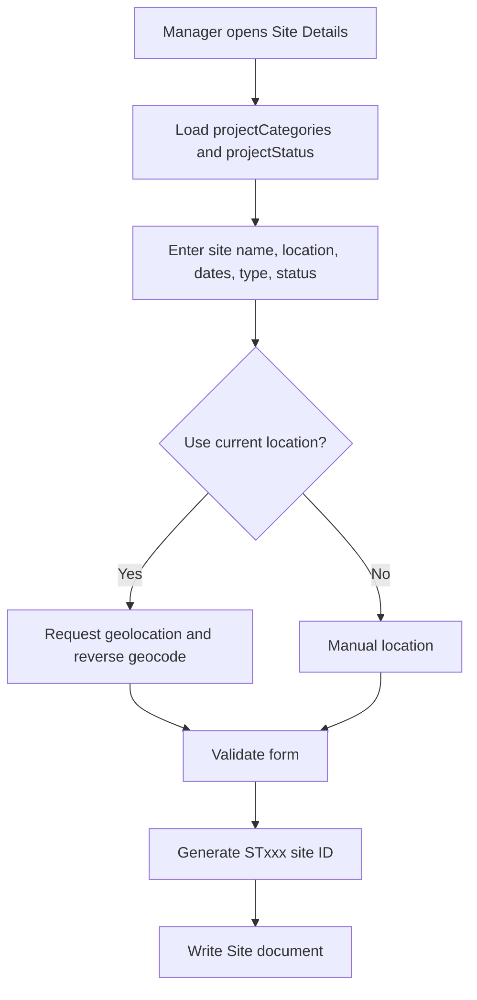

### Project Creation Flow

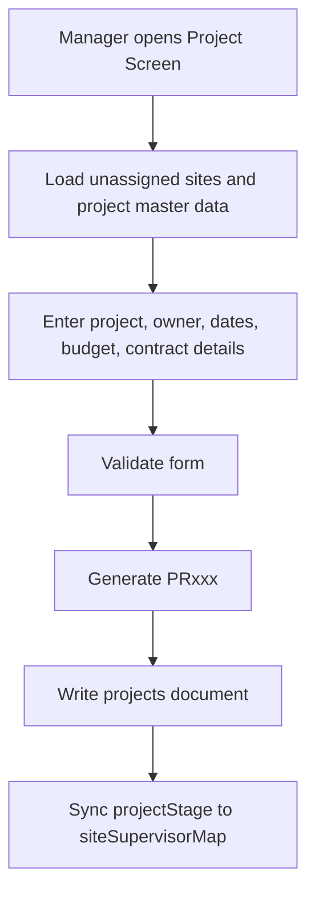

### Supervisor Assignment Flow

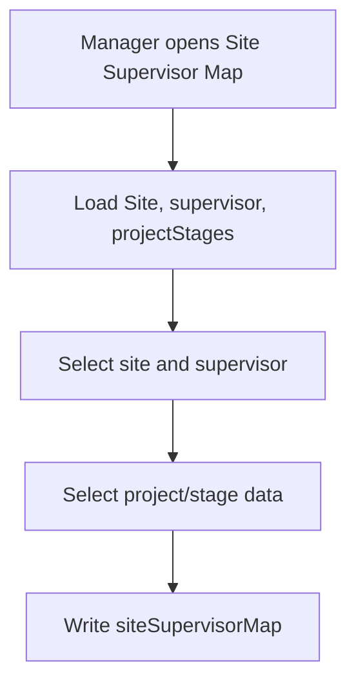

### Sub Contractor Creation Flow

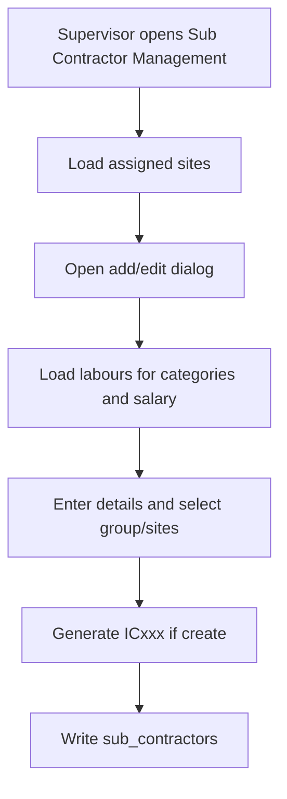

### Worker Creation Flow

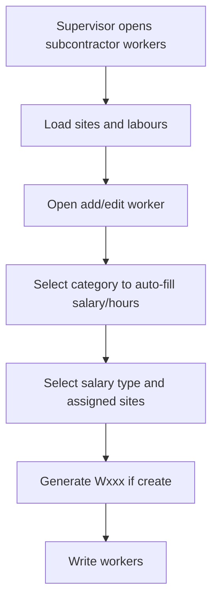

### Attendance Entry Flow

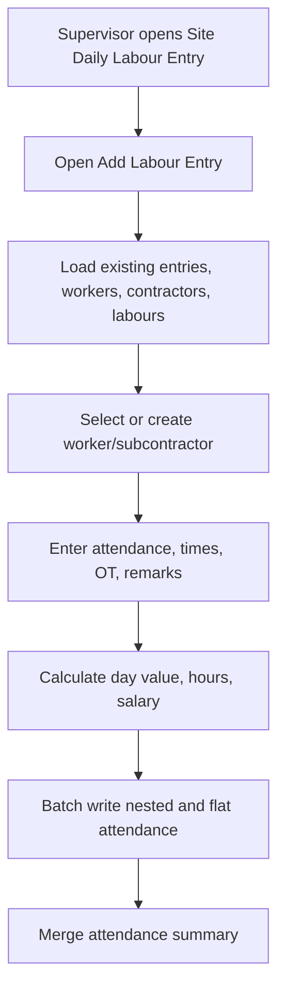

### Meals Entry Flow

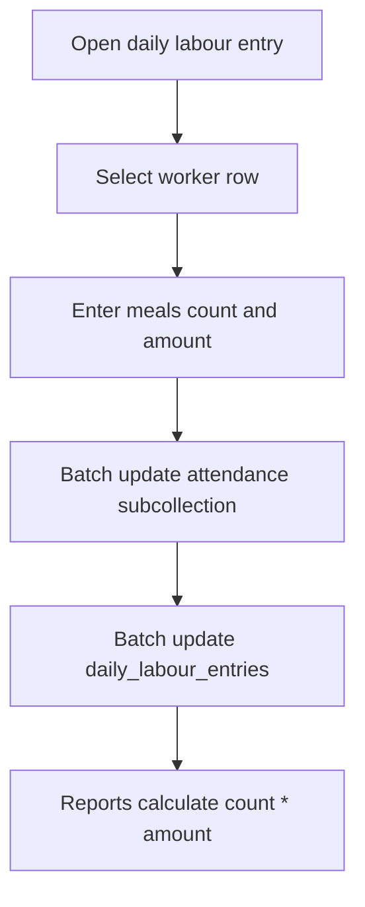

### Bus Fare Entry Flow


### Report Generation Flow

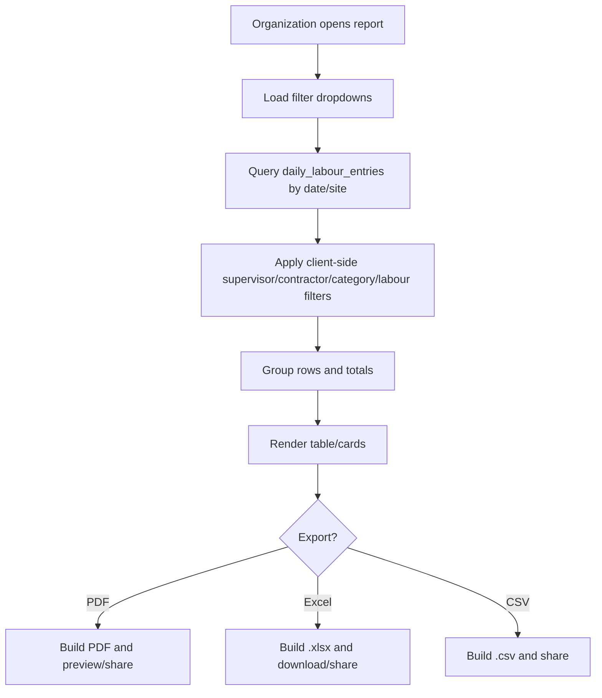

## 14. Screens Documentation

| Screen | Purpose | Key data |
| --- | --- | --- |
| `SplashScreen` | App launch screen | Assets and routing |
| `LetsStartPage` | Landing/start screen | Navigation to dashboard |
| `MainDashboard` | Role selector | Organization, Manager, Supervisor, Sub-Contractor cards |
| `Organisation_LoginPage` | Organization login | `organizationUser`, SharedPreferences |
| `Organization_Dashboard` | Organization module menu | Reports and organization flows |
| `config_login` | Manager/config login | `configUser` |
| `config_account_dashboard` | Manager/config dashboard | Configuration navigation |
| `SiteScreen` | Create/list/manage sites | `Site`, `projectCategories`, `projectStatus` |
| `ProjectScreen` | Project creation/update | `projects`, `Site`, `siteSupervisorMap`, `totalSiteExpensesPerDay` |
| `SiteSupervisorConfig` | Supervisor CRUD/password | `supervisor`, `supervisorDesignation` |
| `site_supervisor_map_screen` | Assign supervisors to sites | `Site`, `supervisor`, `projectStages`, `siteSupervisorMap` |
| `labour_screen` / `labour_config_page` | Labour master configuration | `labours` |
| `contractor_page` | Legacy contractor management | `contractors`, `siteSupervisorMap` |
| `Supervisor_LoginPage` | Supervisor/contractor-mode login | `supervisor`, `contractors`, SharedPreferences |
| `supervisor_dashboard` | Supervisor module menu | Assigned sites, contractors, attendance counts |
| `SubContractorManagementScreen` | Newer subcontractor management | `sub_contractors`, `siteSupervisorMap`, `labours` |
| `SubContractorWorkersScreen` | Workers under subcontractor | `workers`, `labours`, `siteSupervisorMap` |
| `daily_labour_entry_screen` | Daily labour entry list/update | `attendance`, `daily_labour_entries` |
| `AddLabourEntryModal` | Attendance add modal | `workers`, `contractors`, `sub_contractors`, `labours` |
| `SiteLabourAttendanceReportScreen` | Register-style labour report | `daily_labour_entries`, `site_labour_reports` |
| `SiteLabourDetailsReportScreen` | Detailed labour cost/meals/bus report | `daily_labour_entries` |
| `manager_site_entry_page`, `site_entry_page`, `site_contractor_entry_page` | Site expense/entry workflows | `siteSupervisorEntries`, `contractorEntries`, materials/labours |
| Material screens | Material master, movement, request, approval | `materials*`, `siteMaterialsRequest` |
| Tool screens | Tool master, movement, inventory reports | `tools*` collections |
| Vehicle screens | Driver, vehicle, inventory, movement | `drivers`, `vehicleDetails`, `vehicleMovements` |

Screenshot placeholders:

- `[Screenshot: Main Dashboard]`
- `[Screenshot: Site Management]`
- `[Screenshot: Project Management]`
- `[Screenshot: Supervisor Dashboard]`
- `[Screenshot: Add/Edit Sub Contractor Modal]`
- `[Screenshot: Worker Form]`
- `[Screenshot: Daily Labour Entry]`
- `[Screenshot: Labour Attendance Report]`
- `[Screenshot: Labour Details Report]`

## 15. Error Handling

Patterns used:

- Form validators return inline validation messages.
- `SnackBar` displays validation failures, save errors, report generation errors, and success messages.
- `AlertDialog` is used for login failures, password reset, delete confirmation, and success dialogs.
- `try/catch` wraps Firestore calls in most create/update/report flows.
- Some report/filter methods catch and ignore errors, leaving loading state false.
- Service methods often return early if IDs are missing.

Examples:

- Site location errors are shown as red snackbars.
- Report generation errors show `Error generating report: ...`.
- Export errors show `PDF download failed`, `Excel download failed`, `Error exporting Excel`, or `Error exporting CSV`.
- Supervisor uniqueness failures show explicit duplicate username/contact snackbars.

## 16. Deployment Guide

### Environment Setup

1. Install Flutter SDK compatible with Dart `^3.8.1`.
2. Install platform tooling for target platforms: Android Studio/Xcode/Visual Studio as needed.
3. Ensure Firebase project access to `cst-pratap-demo`.
4. Run `flutter pub get` from `Ideal_cst_app/`.

### Dependencies

Defined in `pubspec.yaml`:

- Firebase: `firebase_core`, `firebase_auth`, `cloud_firestore`, `firebase_storage`
- Reports/files: `pdf`, `printing`, `excel_community`, `path_provider`, `open_file`, `share_plus`
- Device APIs: `geolocator`, `geocoding`, `image_picker`, `file_picker`
- UI/utilities: `intl`, `lottie`, `flutter_staggered_animations`, `table_calendar`, `shared_preferences`, WebView packages

### Build Process

```bash
flutter pub get
flutter analyze
flutter test
flutter build apk
flutter build web
```

### Firebase/Hosting

- `firebase.json` contains FlutterFire metadata for project `cst-pratap-demo`.
- `docs/` currently contains generated Flutter web build artifacts (`index.html`, `main.dart.js`, CanvasKit, assets).
- If deploying from `docs/`, rebuild web output into the expected hosting directory and confirm Firebase Hosting config in the deployment environment.

### Environment Variables

No `.env` or environment-variable based configuration is implemented. Firebase config is compiled into `lib/firebase_options.dart` and Android config is in `android/app/google-services.json`.

## 17. Future Enhancements

### Performance

- Add composite Firestore indexes for frequent multi-field/range queries.
- Reduce client-side filtering for large report datasets by moving filters into Firestore queries or backend aggregation.
- Introduce pagination for large collections in management screens.
- Avoid loading entire master collections when only selected site/supervisor data is needed.

### Security

- Replace Firestore plaintext credential checks with Firebase Authentication.
- Add Firestore security rules enforcing role-based access.
- Add Firebase Auth custom claims or a secure roles collection.
- Audit Firebase Storage upload/download permissions.
- Avoid storing passwords in SharedPreferences.

### Scalability

- Add a backend/API layer for privileged operations, reports, and financial aggregation.
- Consolidate legacy and newer worker/subcontractor data paths.
- Standardize collection naming conventions, especially `Site` vs `sites`, `materialatsite` vs `materialsAtSite`, and `WorkerSummary` vs `workersSummary`.
- Add migration scripts for old contractor/worker data into the newer workforce model.

### Quality

- Add unit tests for salary, overtime, meals, bus fare, and report grouping calculations.
- Add widget tests for critical forms and login flows.
- Add schema documentation or typed repository layer for direct Firestore screens.
- Add CI checks for `flutter analyze` and `flutter test`.

### Product

- Add role-aware dashboards with server-enforced permissions.
- Add attendance edit audit trail.
- Add offline-first attendance capture.
- Add approval workflow for subcontractor and worker creation.
- Add richer PDF templates and scheduled report delivery.

## Source Reference Index

| Area | Source files |
| --- | --- |
| App bootstrap | `lib/main.dart`, `lib/firebase_options.dart` |
| Dependencies | `pubspec.yaml` |
| Workforce services | `lib/services/workforce_service.dart`, `lib/services/attendance_service.dart`, `lib/services/salary_service.dart`, `lib/services/expense_service.dart` |
| Models | `lib/models/*.dart` |
| Authentication | `lib/screens/Organisation_LoginPage.dart`, `lib/screens/config_login.dart`, `lib/screens/supervisor_login_page.dart`, `lib/screens/contractor_login_page.dart` |
| Site/project/supervisor config | `lib/screens/site_screen.dart`, `lib/screens/project_screen.dart`, `lib/screens/Site_Supervisor_Config.dart`, `lib/screens/site_supervisor_map_screen.dart` |
| Subcontractor/worker | `lib/screens/sub_contractor_management_screen.dart`, `lib/screens/sub_contractor_workers_screen.dart` |
| Attendance | `lib/screens/add_labour_entry_modal.dart`, `lib/screens/daily_labour_entry_screen.dart` |
| Reports | `lib/screens/site_labour_attendance_report_screen.dart`, `lib/screens/site_labour_details_report_screen.dart` |
| Expenses | `lib/services/expense_service.dart`, `lib/screens/manager_site_entry_page.dart`, `lib/screens/manager_expenses.dart`, `lib/screens/site_summary_page.dart` |
| Materials/tools/vehicles | `lib/screens/config_material_information.dart`, `lib/screens/Supervisor_material_information.dart`, `lib/screens/tools_master_page.dart`, `lib/screens/tools_movement_page.dart`, `lib/screens/vehicle_config_page.dart` |
